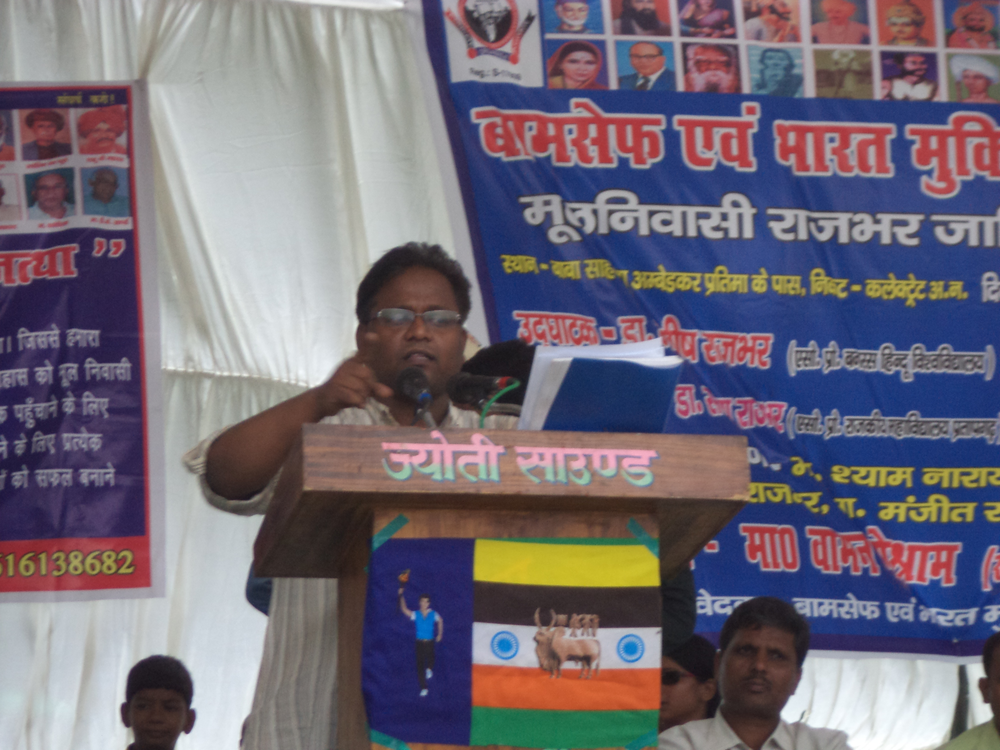
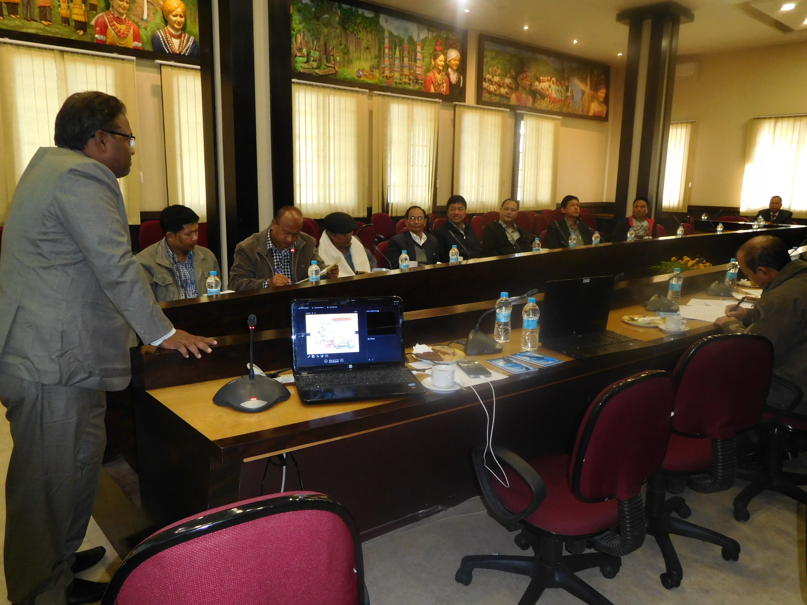
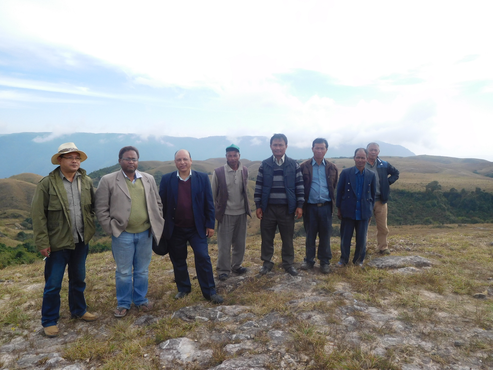
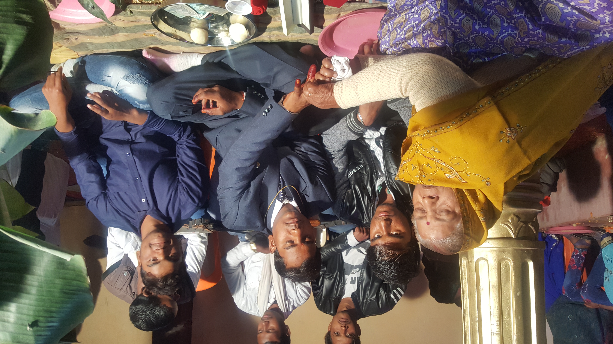
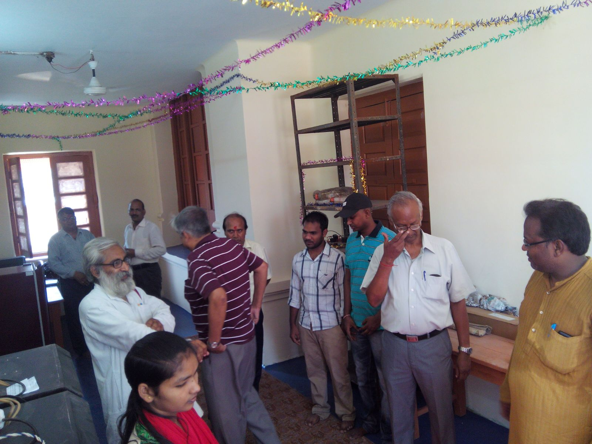
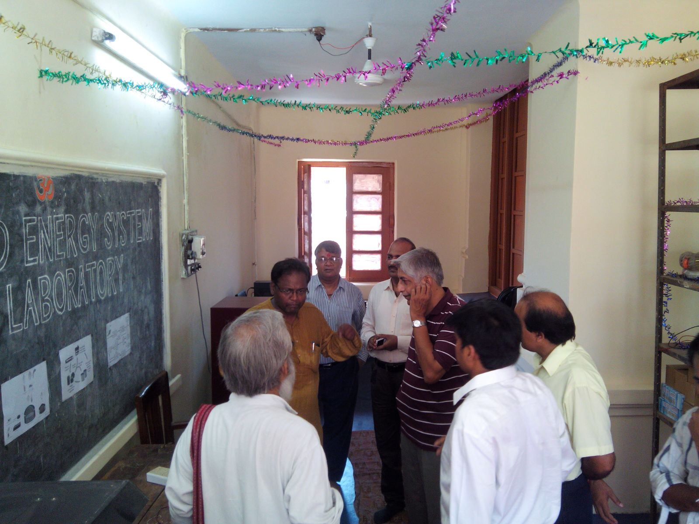
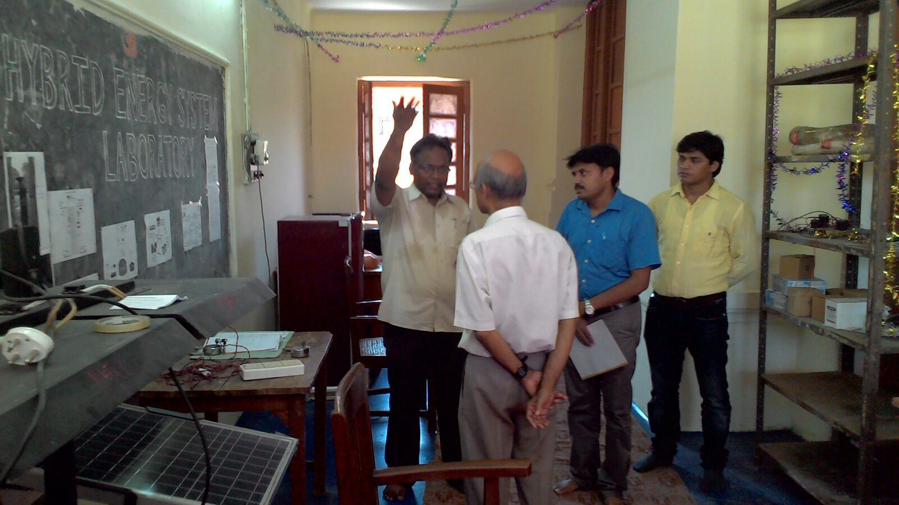

gallery.html>
<!DOCTYPE html>
<html lang="en">
<head>
  <meta charset="UTF-8">
  <title>Photo Gallery | Dr. Manish Kumar</title>
  <meta name="viewport" content="width=device-width, initial-scale=1.0">
  <link rel="stylesheet" href="assets/css/style.css">
  
</head>
<body>
<header>
  

    

      

        <h1>Dr. Manish Kumar</h1>
        
Assistant Professor, IIT (BHU) Varanasi

      

      <nav>
        <a href="index.html">Home</a>
        <a href="gallery.html">Gallery</a>
        <a href="publications.html">Publications</a>
        <a href="research.html">Research</a>
      </nav>
    

  

</header>

<main class="container">
  <h2>Photo Gallery</h2>

  <section class="album">
    <h3>Field Visits & Rural Energy</h3>
    
On-site demonstrations and field work for the 1.5 MW Integrated Dairy & Smart Hybrid Energy Systems and rural electrification projects.[file:83]

    

      <figure>
        
        <figcaption>Azamgarh, 2016 – Hybrid Energy System Demonstration</figcaption>
      </figure>
      <figure>
        
        <figcaption>Meghalaya – Presentation to State Planning Board</figcaption>
        
        <figcaption>Meghalaya – Field visit with State Planning Board</figcaption>
      </figure>
      <figure>
        
        <figcaption>Tamauli village – Saansad Adarsh Gram Yojana site</figcaption>
      </figure>
    

  </section>

  <section class="album">
    <h3>Academic Campus Life & International Conferences</h3>
    
Moments from IIT (BHU) campus, laboratory environments, and interactions with students.[file:83]

    

      <figure>
        
        <figcaption>Prototype Lab – Integrated Dairy & Smart Hybrid Energy Systems</figcaption>
      </figure>
      <figure>
        
        <figcaption>Prototype Lab – Integrated Dairy & Smart Hybrid Energy Systems</figcaption>
      </figure>
      <figure>
        
        <figcaption>CERD, IIT (BHU) – Center for Energy Resources and Development</figcaption>
      </figure>
    

  </section>

  <section class="album">
   <h3>International Conferences</h3>
    
Photographs from invited talks and conferences in Japan, Prague, Zurich, Chicago, Singapore etc.[file:83]

    

      <figure>
        
        <figcaption>Japan, 2009 – Advances in Physics Conference</figcaption>
      </figure>
      <figure>
        
        <figcaption>Prague, 2019 – EMN Meeting on Terahertz</figcaption>
      </figure>
      <figure>
        
        <figcaption>Zurich, 2019 – World-wide Congregation on Physics</figcaption>
      </figure>
    

  </section> 
  
</main>

<footer>
  

    
&copy; 2025 Dr. Manish Kumar · ORCID: 0000-0001-6053-3667

  

</footer>
</body>
</html>
